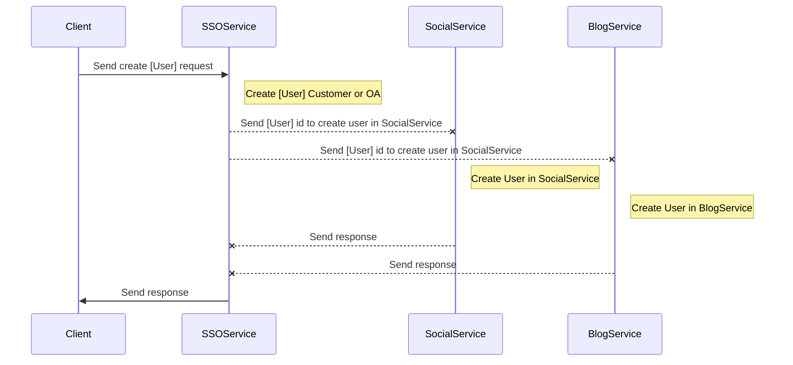
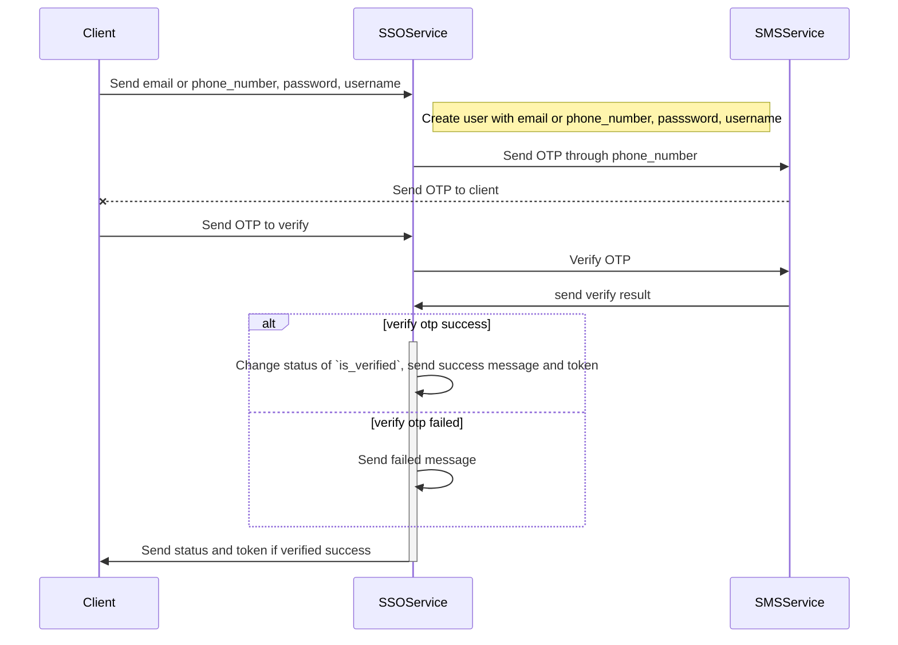
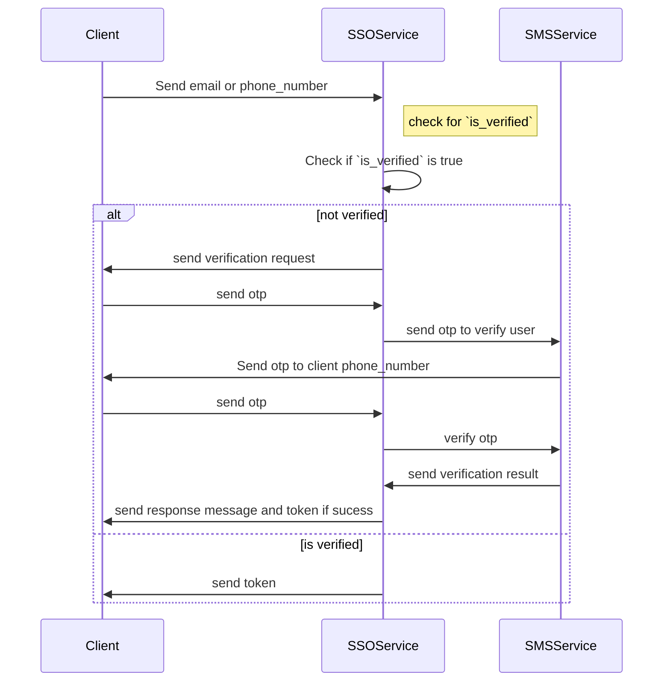

## Signup flow

## Create user in other services when signup

```mermaid
sequenceDiagram
  participant Client
  participant SSOService
  participant SocialService
  participant BlogService

  Client ->> SSOService: Send create [User] request
  Note right of SSOService: Create [User] Customer or OA
  SSOService --x SocialService: Send [User] id to create user in SocialService
  SSOService --x BlogService: Send [User] id to create user in SocialService
  Note right of SocialService: Create User in SocialService
  Note right of BlogService: Create User in BlogService
  SocialService --x SSOService: Send response
  BlogService --x SSOService: Send response
  SSOService ->> Client: Send response
```

## Signup flow (OTP related) phone_number

```mermaid
sequenceDiagram
  participant Client
  participant SSOService
  participant SMSService

  Client ->> SSOService: Send email or phone_number, password, username
  Note right of SSOService: Create user with email or phone_number, passsword, username
  SSOService ->> SMSService: Send OTP through phone_number
  SMSService --x Client: Send OTP to client
  Client ->> SSOService: Send OTP to verify
  SSOService ->> SMSService: Verify OTP
  SMSService ->> SSOService: send verify result
  alt verify otp success
    activate SSOService
    SSOService ->> SSOService: Change status of `is_verified`, send success message and token
  else verify otp failed
    SSOService ->> SSOService: Send failed message
  end
  SSOService ->> Client: Send status and token if verified success
  deactivate SSOService
```

## Signin flow (OTP when user not verified) phone_number

```mermaid
sequenceDiagram
  participant Client
  participant SSOService
  participant SMSService

  Client ->> SSOService: Send email or phone_number
  Note right of SSOService: check for `is_verified`
  SSOService ->> SSOService: Check if `is_verified` is true
  alt not verified
    SSOService ->> Client: send verification request
    Client ->> SSOService: send otp
    SSOService ->> SMSService: send otp to verify user
    SMSService ->> Client: Send otp to client phone_number
    Client ->> SSOService: send otp
    SSOService ->> SMSService: verify otp
    SMSService ->> SSOService: send verification result
    SSOService ->> Client: send response message and token if sucess
  else is verified
    SSOService ->> Client: send token
  end

```
