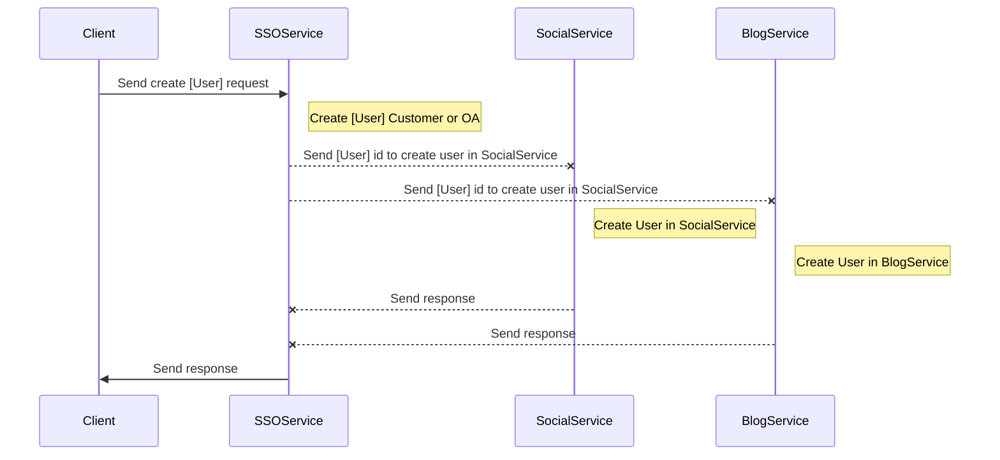

## Signup flow

## Create user in other services when signup

```mermaid
sequenceDiagram
  participant Client
  participant SSOService
  participant SocialService
  participant BlogService

  Client ->> SSOService: Send create [User] request
  Note right of SSOService: Create [User] Customer or OA
  SSOService --x SocialService: Send [User] id to create user in SocialService
  SSOService --x BlogService: Send [User] id to create user in SocialService
  Note right of SocialService: Create User in SocialService
  Note right of BlogService: Create User in BlogService
  SocialService --x SSOService: Send response
  BlogService --x SSOService: Send response
  SSOService ->> Client: Send response
```
